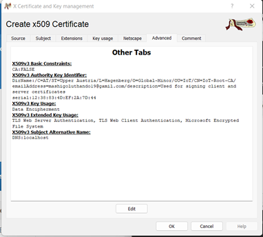
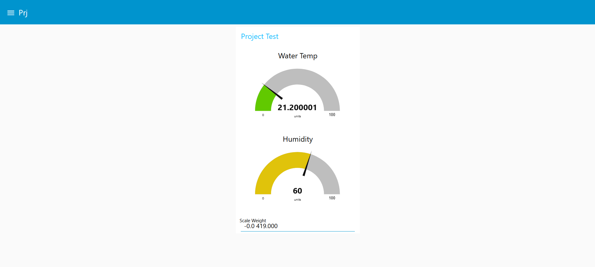

# <i>Group Documentation <i/>

# Group Members:

- Lena Aschauer 
- Amadeo Noels 
- Luthando Mashigo 
- Josias Hoffman
 
 
# Week 1 

## 7/11

### The kit - table
 
This the <a href= https://docs.google.com/document/d/1s6Q4YwDniuX3-o7bFId8eT2VyiTMTn_2Ks8KojxuRqM/edit >link <a/> to our table which staes all the devices. 
 
### Gateway setup log

We started of by downloading the image for the raspberry pi which our professors provide for us. After some problems we were able to flash the image via the flashing software balena etcher to the rpi. Then we were able to connect the rpi with the wifi and so we had our own local network.

It was also very exciting to set up our own IoTempower gateway. This will certainly help us in our project, since we want to work with a Raspberry Pi. However, we also had problems, because the flashing of the pi image to the SD card crashed every time. In the end it turned out that our wifi card was unfortunately broken.

### Gateway service offered

After that we took a look at the provided services. We have now access to IoTempower via a web browser. Via ioTempower we are able to use Node-RED and the Node-RED UI as well as the file-system of IoTempower and a documentation about everything.
 
## 9/11

### IoT Architecture

IoT Architecture:

 

Server: It is a Data Integration Controller equipped with a highly reliable industrial computer and non-programming data integration software. It is capable of collecting, processing, storing, reporting, and publishing data through standard data management functions developed.

Nodes: The main two features of an IoT node are to manage the interconnection between the hardware and the rest of the network and to recollect the information generated by itself. In other words, the IoT nodes are the elements within an IoT ecosystem that allow the connection of the physical world with the Internet.

Gateway: An IoT gateway is a centralized hub that connects IoT devices and sensors to cloud-based computing and data processing. IoT gateways are designed to simplify and streamline IoT device communications and management.

Cloud: Cloud computing is a platform where one can view a computer, storage and network infrastructure as an abstract entity. This allows us to deploy systems quickly and scale easily. Very important here is thinking of self-service. Which means that users can get started via filling out a Web form.

Things: A thing, in the context of the Internet of things (IoT), is an entity or physical object that has a unique identifier, an embedded system and the ability to transfer data over a network.

Edge: This is about processing, analyzing and storing data close to where it is generated to enable easy real-time analysis and response.

Swarm: Swarm Intelligence systems are decentralized, self-organized algorithms used to resolve complex problems with dynamic properties, incomplete information, and limited computation capabilities. Swarm Intelligence can enable a collection of multiple IoT devices to work together and exchange information, thereby achieving greater utility.

Fog: This refers to a layer located between the cloud and the edge. Fog is in the ability to capture information from the edge layer before it reaches the cloud. This aims to decide which driven information is relevant and which is not. This allows the relevant data to be stored in the cloud while the unnecessary information can be removed.

# Week 2

## 14/11

### IOT Integration task :

We are getting the RFID Reader wemos d1 flashed. The Wemos d1 that will be used for the RFID scanner is flashed however we tried to research on how to send data of what the RFID reader is receiving via MQTT.  Still didn’t work but because our RFID reader is actual damaged in a matter we do not understand, and we tested with another teams RFID reader and the program actual works. The lecturer tried to re soldered er the RFID reader, but it failed, and the RFID reader does not work. We are now trying to connect the relay to a female wemos but the wemos was incorrectly soldered so we are using a different one. We are now getting the relay and lock to work.  We have configured the relay to function with the lock so that we could send mqtt messages from node red and receive them on the programmed wemos d1 mini with the topic Relay_Shield/Lock/set as shown in the screen shot.

What would happen when we flip the switch in node red it would send an on signal to the topic and then the lock would respond by either locking or unlocking.
 
Here is our setup.cpp file for the lock and relay as shown in the image below.

We are building the rest of the integration with the traffic light and the rfid senor works and are able to send data via MQTT and be able to build logic to have the lights of the traffic light switch on based on certain conditions such as turning the light red for access denied and turning green for having the right key card.  We wired the traffic light incorrectly by putting the red into ground instead of D2. However regardless the red light constantly remained on  but we are rewiring the traffic light hardware to a female wemos. We plugged the wire meant for green into the yellow pin. We got the traffic light working and there will be images to display how the works. We are now re integrating the lock and relay and we are testing using previous complied logic. We used the wrong pin output for the logic and now it works. Our topic now was incorrect. So, we had to use D1 instead of D2 since the data line in the relay is connected to D1. 

We now trying to now integrate the buzzer and we have to use another wemos and are flashing using the PI for the initial. We are looking into the documentation. When access is granted, the buzzer does make a sound. So Lastly we have the flow that made the program function as best as it.

Please find all the images blow of the hardware implementation.

 

 

 

 

 

 

 

 

Also please find the node red flow for the entire implementation.

 
## 16/11

### IoT Scenaios 

We presented all our IoT scenarios, here are both : 
 
Scenario 1 
Personnel :
Owner: Mara sells fresh vegetables and fish at markets, which come from her aquaponics unit in a rural area. Employee: Jon is a farmer and has been taking care of Mara's aquaponics unit since 5 years. He is also a chain smoker. Technican: Paul is a young student who is currently working as a part-time technican for Mara's aquaponics unit.

Facility IOT Devices :
Soil Moisture Sensor - Detects over-saturated patches of soil Pump - Measures how much water flows into a tank Flame sensor - Detects flames within the facility.
Temp Metre - detect and regulate temperature in the facility Motion Sensors - Scattered around the facility for movement detection. Rfid tag scanner - Placed by the entrance to the facility and within the motion sensors around the facility. Weight sensor - To measure the weight of the fish in the tank.

Tuesday, 10.01.2022
Mara and Paul were awakened in the morning by a notification on their phone. The soil moistire sensor has detected that the plants don't have enough water. Paul gets to the aquaponics facility and scans his rfid tag. The door unlocks and at the same time Mara gets a notification on her phone that Paul has arrived at the aquaponics facility. Paul looks at his phone and sees that the pumps and the temp metre are working properly. Paul takes a closer look at the facility and discovers that a pipe is leaking, which means less water is getting to the plants. Paul repairs the pipe and adds a report on his application. Mara gets a notification that the problem with the soil moistire has been solved.

Monday, 20.04.2022
Jon arrives at the aquaponics facility and scans his rfid tag. Mara gets a notification that that Jon has arrived at the aquaponics facility. Jon monitors all the aquaponics devices from his mobile phone while smoking a cigarette.
After that Jon starts his farmwork by harvesting lettuce and tomatoes.
While at work, Jon continues to smoke and be careless. He throws his cigarette on a pile of hay and fire starts. Mara gets an notification from the flame sensor that flames has been detected at the facility. At the same time an emergency call is sent to the fire department. Mara checks the application and sees that the a motion sensor has detected a lot of movement in the facility, so she knows, that the firefighters have arrived. In the mean time the firefighters manages to extinguish the fire.
Jon adds a report on the application that the fire has been put out. He also enters a command that he is very sorry about the incident and that luckily nothing was damaged. Jon continues his farmwork without smoking any cigarettes anymore. In the evening Mara is lying in her bed and takes a look at the reports which has been posted on the application. Shaking her head, she falls asleep and wonders what is in store for her tomorrow.

Friday, 02.08.2022
Jon arrives at the aquaponics facility. Jon takes the fish out of the tank to prepare them for the market and puts in new young fish. Mara gets a notfication from the weight sensor, because the weight of the tank has changed drastically. Now she knows that Jon has prapered the fish for the market. At 5 o'clock Jon signs out via his rfid tag. Mara receives a notification that Jon has left the facility. 

Scenario 2:

Aquaponics 

Personnel : 
Owner: Phil is a small business owner and owns an aquaponics unit in a rural area. 
Technician: Bob is a rookie technician and on his way to his first job. 
Criminal: James is an aspiring criminal and is well on his way to paying off his student loans by selling stolen fish.
Security: Carlos is a retired police officer and is currently working as a part-time security guard for Phil's aquaponics unit.

Facility IOT Devices : 
Motion Sensors - Scattered around the facility for movement detection.
Rfid tag scanner - Placed by the entrance to the facility and within the motion sensors around the facility. 
Smoke detector - Detects smoke and sends a notification to the owner that there is a fire or the possibly of one.
CO2 detector - constantly runs and monitors co2 levels through the facility and are placed in as many locations as possible and co2 levels can be monitored within the application in real time.

Bob gets to the aquaponics facility and scans his rfid tag.
The door unlocks. 
Phil gets a notification on his phone that the new technician has arrived at the aquaponics facility.
Both Phil and Bob receive a notifcation that the pump in tank two is malfunctioning.
The notification has data on waterflow levels for the past 2 hours and it seems waterflow has been degrading steadily.
Bob arrives and fixes the malfunction.
Bob adds a report on his application and posts it. 
Phil receives a notification that Bob has fixed the malfunctioning pump and sees the report that Bob made. 
Phil also receives a reccommendation on replacement pumps and common problems.
Bob walks around the facility and the rfid tag on his person pings his relative location to the motion Sensors around the fish tank area and other sections of the facility.
The Motion Sensor has a rfid scanner that identifies Bob as a technican based on the rfid tag he has on his person.
Bob continues monitoring all the aquaponics devices from his mobile phone whilst sipping an esspresso. 
Bob signs out via his rfid tag since it is now 5 o'clock and quitting time.
Phil receives a notification that Bob has left the facility.
Phil can see a detailed report of how many hours Bob has worked this week.
Phil can also see which problems Bob has solved so far.
As Bob leaves the facility the locks on the door as well as motion sensors activate.
After Bob has left, James sees his chance to break into the facility.
James tries to enter through the front door but finds that it is locked.
Next, James breaks a window and climbs through.
A motion sensor detects movement near tank five due to the rfid scanner not detecting any valid tag when movement was detected.
The motion sensor sends a notfication to Phil as well as Carlos.
Carlos receives the notfication and goes to investigate the disturbance.
Motion sensors update Carlos on the position of the disturbance at his request.
It seems that the disturbance has moved from tank five to tank four. 
Carlos deduces that the next disturbance will be at tank three.
Carlos catches James stealing fish from the tanks and detains him.
Carlos writes a report and submits it on the application.
Phil receives the notification that Carlos has detained a criminal.
Phil also receives the report that Carlos has submitted.

### Current State of Project
 
We presented the current state of project which is <a href=https://docs.google.com/presentation/d/1AB9427Mz43Jxqp1JAkuUrCHxulFLlcXiawb3ESTPtyg/edit#slide=id.gc6f9e470d_0_0>here<a/>
 
## 17/11
 
### Checkout, compile and install SNode.C and the MQTTBrkoer on the Rasperry-PI

install on the raspberry pi

- installeren van de dependencies met volgend commando: sudo apt install doxygen iwyu clang-format cmake-format libmagic-dev libbackward-cpp-dev libdw-dev libdwarf-dev binutils-dev librange-v3-dev libssl-dev libeasyloggingpp-dev libbluetooth-dev nlohmann-json3-dev : in de iot-system folder

compiling snodec:

<ul> 
<li> Create a new folder: iotprojs</li>
<li> Therein a new map: snodec</li>
<li> Install git</li>
<li> Clone the repository: https://github.com/VolkerChristian/snode.c</li>
<li> Create new folder: mqttbroker</li>
<li> Clone the repository:</li>  <li> https://github.com/VolkerChristian/mqttbroker</li>
<li> cd back to snodec</li>
<li> Create a new folder build</li>
<li> command: cmake ../snode.c/ => zoeken naar Clist <=></li>
<li> command: make -j 16 (threads) => compiling snode</li>
<li> build directory => sudo make install</li>
 
</ul>

# install mqttbroker and install httpserver and analzing the cde:

After examining the snode.c and MQTTbroker source code. One of the most crucial ideas was how to establish a web server object and which header file to utilize. Right down to the app, creating a http server object is fairly similar to that of node.js and express framework. At the conclusion, pay attention.
The anatomy of the "app" dot functions, such as app.get, app.post, app.use, and app.listen, was then discussed by the sir. App dot functions are essentially the application's foundation; you provide a route in the function and build a request and response, callback method next to it  , then send the desired message.

When we entered "/" in the route field, the application's home page will be displayed, where an index.html file can be received and rendered.
 
Also have installed the mqqtbroker device wide and had to run it by using a couple commands such as legcyin and such and entering the port number sp that we can start the broker and we could also save the configuration of the broker to a config file

# Week 3
 
## 21/11/2022

***create an mqqtbrokerwebserver application***  

create new directory => mqqtwebfrontend  
right click -> add new -> General -> Empty File -> chose -> name the file -> CMakeLists.txt 
copy existing CmakeLists.txt to the new CMakeLists.txt -> only adapt the parts that need to be adapted 
CMakeLists.txt 
--> line 51 & 53 : rename variable to mqttwebfrontend 
--> line 57 : rename variable to mqttwebfrontend 
--> line 60 : change targetname to mqqtwebfrontend 
--> line 65 : change name to mqqtwebfrontend  
--> line 73 : change broker to mqqtwebfrontend 
--> line 77 : change to mqttwebfrontend 

copy mqttbroker folder content: 
--> cpp && h copy (5) them to the mqqtwebfrontend 

binary directory /usr/local/bin  

--> integrate directory in the whole project  

--> root CMakeLists.txt file  
add_subdirectory mqttwebfrontend 

mqttbroker (main) -> set it as active project  

rename mqttbroker.cpp in mqttwebfrontend directory 
 --> right click --> Rename --> mqttwebfrontend.cpp 

**add webfunctionality** 

--> go to snode.c in the filesystem  
 source directory ==> src/apps/testpost.cpp 
split screen : right side split view 

**implement webfrontend** 

--> create unencryped   
add an include (express/legacy/in ...) 

copy express line and past it at the end of the line just before "return core:SNodeC::start(); 
 --> rename legacy to mqttWebView 
 --> als server instance to mqttwebview 
 
 error thrown : during link fase  
  --> we didn't link the webfrontend application to a library  
  --> !!! needed for the webfrontendapplication 
 
 add library :  
  --> CMakeLists.txt (first one) --> find package() src/apps/CMakeLists.txt -> http-server-express 
 
 add it in the find package 
 
 mqttwebfrontend --> add library --> target_link_libraries 
 
 mqttwebfrontend.cpp --> add functionality -->  mqttWebView.listen() -> copy mqttlistenLegancyServer to the mqttWebView.listen() 
 
 test the build : directory --> ./mqttwebfrontend --> error legacyin is required --> ./mqttwebfrontend legacyin local --port 1883 tlsin  local --port 8883 legacyun local --path /tmp/mqttwebfrontend mqttwebview local --port 8080 -w 
 
the command : ./mqttwebfrontend can now be used because there is a config file present 

in the file mqttwebfrontend.cpp:  
 --> mqttWebView.get("/test", [] APPLICATION(req, res){ 
 VLOG(0) << "#############" << "Here we are" << req.originalUrl; 
 res.send("Response FROM MQTTWebView"); 
 }); 
 
 mqttfrontend --> right click --> add new  --> c/c++ --> c++ Class --> specify name ('MqttModel')   
 line 51 --> add MqttModel.cpp  
 line 53 --> add MqttModel.h 
 
 **build application**
 
 file MqttModel.h 
 include 'iot/mqtt/packets/Connect.h' 
 --> private : add MqttModel() 
 --> public :  
    --> static MqttModel & instance(); --> righ click -> refacor -> add definiation MqttModel.cpp 
    --> void addConnectedClient(iot::mqtt::packets::Connect& connect); -> right click -> refactor 
 
 MqttModel&MqttModel::create(){ 
 static MqttModel mqttModel; 
 --> static means only one time created   
 return mqttModel; 
 } 
 
 in the file SocketContext.h: 
 
 add includ 'iot/mqtt/server/broker/Broker.h' 
 
 --> private :  
    --> void onConnect(iot::mqtt::packets::Connect& connect) override{ 
      --> connectionList.push_back(connect); 
      } 
    --> void onPlublish(iot::mqtt::packets::Publish& publish) override; 
    
 refactor fase  
 
 onConnect method: 
    --> MqttModel::instance().addConnectedClient(connect); 
    
 implement method addConnectedClient 
 
 in the file MqttModel.h 
 
 add include <list> 
 
 --> public 
    --> const std::list<iot::mqtt::packets::Connect>& getConnectedClients(); 
 
 --> protected: 
    --> std::list<iot::mqtt::packets::Connect> connectionList; 
 
 in the file MqqtModel.cpp : 
 
 --> const std::list<iot::mqtt::packets::Connect>& MqttModel::getConnectedClients(){ 
 return connectionList; 
 } 
 
 in the file mqttwebfrontend.cpp 
 
 --> mqttWebView.get("/clients", [] APPLICATION(req, res){ 
 const std::list<iot::mqtt:packets::Connect>& connectList = MqttModel::instance().getConnectedClients(); 
 MqttModel::instance().getConnectedClients(); 
 std::string responseString; 
 
 for(const iot::mqtt:packets::Connect& connection : connectionList){ 
  connection.getClientId(); 
 }); 
 
 res.send(responseString); 
 }); 
 
 --> header file is missing  
 
 --> add an include 'MqttModel.h 
 
 
   
 
## 23/11/2022

### We have to stop mqtt boot to not being started during boot.  ##
-> have to edit the iot>lib>system_boot>raspi-boot.sh file on the rpi.  
delete:  
new-window -d -n MQTT 
su- $IOTEMPOWER_USER -c 'echo iot exec mqtt broker'  
new-window -d -n cloudcm  
su - $IOTEMPOWER_USER -c 'echo iot exec cloudmd_starter' 

command cd .local/bin  
command ./nodered_starter  
command ps -aef | grep node-red  
command node-red  
command mqttbroker

## 24/11

### Tutorial : Create Root-CA, Endcertificate, Use these Certificates to secure the communication between mqttbroker and the mosquitto_sub/pub task : 

We installed XCA which is a certificate management software and was instructed to make a root certificate and a client and server certificate. We along with our groupmates explored the architecture/system of how certificates work. 

We are also learning how to actually create the certificate within our local linux subsystems and not via the raspberry pi for tutorial purposes.

We are creating a certificate which will be a root CA certificate and defining its basic characteristics

We are always generating a new key for each certificate we make. 

More definition we are giving to the Root CA

We also selected the key usage for the Root Certrificate

Summary of the details of the root CA

Now we are going to create to end certificates for web application purposes , A MQTT Server Certificate and a MQTT Client Certifcate to be specific.

This is my MQTT Server Certificate Summary 

 
MQTT Client Certificate Summary 
 

We are show two scenarios with an httpserver and the interactions with the certificates.
We are exporting the root CA using the PEM format 
We are also exporting the end entity certificate (Server and Client) but we a different method which is the pem chain which has all certificates upto the root. 
 

We also need to export the keys to unlock the certificates.
We export with encryption because then it is password encrypted.
 
 

We are configure the mqtt broker to work , server with the certificates but the lectuere is busy with that.

### Project Implementation:

We also did part of the project implementation with some assistance such as wiring the two esp8266’s with the temperature and scale.
 
 

Also, We worked as a  team to get node red running and have the mqtt topics configured as shown in the node red screen shot. We had to make use of the IOTEmpower framework as we had no framework of our own.

 
Also, along my team we flashed the two esp’s with code that would have us read the temperature , humidity and weight of the scale and pass that to node-red as shown in the setup.cpp files shown below.

 

  
Lastly After the flashing and after receiving data we were able to pass data using these topics and having the program running and then having a temporary node-red UI as a stand in for front end display the data. I just quickly put that together since there was not enough time to fill flesh out the system.

 

