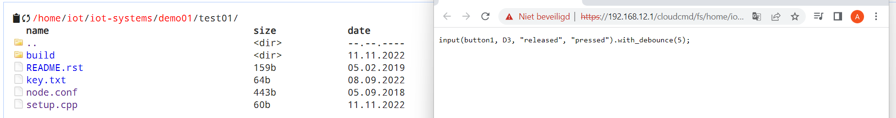

 ## 8/11/2022

***Arduino IDE, drivers + Arduino Hello World (just blink on Wemos D1 Mini)  ***
We started by installing Arduino IDE. You have to teach the Arduino IDE to handle the Wemos D1 Mini Board. So first go to File -> Preferences and click on the icon next to "Additional board manager URLs". In the window that pops up, enter the following in a separate line: https://arduino.esp8266.com/stable/package_esp8266com_index.json. Then we went to Tools -> Board -> Board Manager, searched for "esp8266" and install the package. If the board is not recognized, then  the ch340 driver for the USB-to-serial adapter is missing, which we installed. 
 We started by creating a simple blink led component. We did this by guiding ourselves through the program via the Files => examples => basics => blink buttons. This opened a new window where by using the upload button we could install the provided hardware on one of our ESPs.
After this we moved on to installing a server so we could have it interact with a client at a later stage. To implement this server we used the following steps: file => examples => ESP8266WebServer => HelloServer. If we click the upload button after this, our piece of self-written software will be implemented on the ESP we currently have attached to our computer.

***Wemos D1 Mini, pinout and general intro info, Breadboards and dupont cables***  
The heart of our Wemos D1 Mini Board is the ESP8266EX chip. This is a powerful 32 bit microcontroller with integrated W-LAN interface. The D1 Mini is  versatile because it is inexpensive, WiFi-enabled, and fully compatible with the Arduino platform. The D1 Mini has an ESP8266 at its core, which means that it can do many of the things an Arduino board can do (analog input, digital input, I2C, etc.).

An overview about the pins:  
  

Breadboard:
A Breadboard is simply a board for prototyping or building circuits on. It allows you to place components and connections on the board to make circuits without soldering. The holes in the breadboard take care of your connections by physically holding onto parts or wires where you put them and electrically connecting them inside the board.  

Dupont cables:
Jumper wires are simply wires that have connector pins at each end, allowing them to be used to connect two points to each other without soldering. Jumper wires are typically used with breadboards and other prototyping tools in order to make it easy to change a circuit as needed.  

***Wifi connect*** 
The D1 Mini can handle WiFi communication. The WiFi communication enables the D1 Mini to act as a local server and so much more. We implementet the D1 Mini as a WiFi server by communicating between a device and the D1 Mini by communicating on a local host webpage. 

***Led on/off on Webserver*** 
After we had implemented the server, we got to work on creating a client. We did this using the following steps File => examples => ESP8266WIFI => WIFI. We initialized in the setup method the input of the key pin as well as the output of the led pin. Then in the loop method we added code to check the state of the button so that the light could be adjusted depending on the current state.  

***Pull-ups and touch buttons*** 

***Second ESP8266 with button as Webclient, controlling Webserver***  

***Second LED*** 

***Second button*** 

 ***problems we have overcome today:***
-	We encountered many problems in the beginning for setting up the arduino application. The lecturer did this quite quickly without considering the students in the process.
-	Because we often did not fully understand what was expected of us in class, we needed a lot of feedback from the teacher to redirect us here and there and help us on our way to obtaining the solutions

## 9/11/2022

***Scenario*** 
Personnel :  
Owner: Mara sells fresh vegetables and fish at markets, which come from her aquaponics unit in a rural area. 
Employee: Jon is a farmer and has been taking care of Mara's aquaponics unit since 5 years. He is also a chain smoker.
Technican: Paul is a young student who is currently working as a part-time technican for Mara's aquaponics unit.

Facility IOT Devices :  
Soil Moisture Sensor - Detects over-saturated patches of soil
Pump - Measures how much water flows into a tank
Flame sensor - Detects flames within the facility.  
Temp Metre - detect and regulate temperature in the facility
Motion Sensors - Scattered around the facility for movement detection.
Rfid tag scanner - Placed by the entrance to the facility and within the motion sensors around the facility. 
Weight sensor - To measure the weight of the fish in the tank.

Tuesday, 10.01.2022 
Mara and Paul were awakened in the morning by a notification on their phone. The soil moistire sensor has detected that the plants don't have enough water. 
Paul gets to the aquaponics facility and scans his rfid tag.
The door unlocks and at the same time Mara gets a notification on her phone that Paul has arrived at the aquaponics facility.
Paul looks at his phone and sees that the pumps and the temp metre are working properly. 
Paul takes a closer look at the facility and discovers that a pipe is leaking, which means less water is getting to the plants. 
Paul repairs the pipe and adds a report on his application. 
Mara gets a notification that the problem with the soil moistire has been solved. 

Monday, 20.04.2022 
Jon arrives at the aquaponics facility and scans his rfid tag.
Mara gets a notification that that Jon has arrived at the aquaponics facility.
Jon monitors all the aquaponics devices from his mobile phone while smoking a cigarette.  
After that Jon starts his farmwork by harvesting lettuce and tomatoes.  
While at work, Jon continues to smoke and be careless. He throws his cigarette on a pile of hay and fire starts. 
Mara gets an notification from the flame sensor that flames has been detected at the facility. 
At the same time an emergency call is sent to the fire department.
Mara checks the application and sees that the a motion sensor has detected a lot of movement in the facility, so she knows, that the firefighters have arrived. 
In the mean time the firefighters manages to extinguish the fire.  
Jon adds a report on the application that the fire has been put out. 
He also enters a command that he is very sorry about the incident and that luckily nothing was damaged.
Jon continues his farmwork without smoking any cigarettes anymore.
In the evening Mara is lying in her bed and takes a look at the reports which has been posted on the application.
Shaking her head, she falls asleep and wonders what is in store for her tomorrow.

Friday, 02.08.2022 
Jon arrives at the aquaponics facility. 
Jon takes the fish out of the tank to prepare them for the market and puts in new young fish. 
Mara gets a notfication from the weight sensor, because the weight of the tank has changed drastically. 
Now she knows that Jon has prapered the fish for the market. 
At 5 o'clock Jon signs out via his rfid tag.
Mara receives a notification that Jon has left the facility.

***Node Intro***

We created some injects which send strings via the mqtt out to the mqtt in which is connected with a debugger and shows the injected value in the debug messages.
It's important that the mqtt in topic is the same as the mqtt out topic.

***MQTT exploration with wildcards***

 When a client subscribes to a topic, it can subscribe to the exact topic of a published message, or it can use wildcards to subscribe to multiple topics at once. 
+: A single-level wildcard replaces one topic level. test/a/+/b -> test/a/ab/b, test/a/ac/b  
#: The multi-level wildcard covers many topic levels. The multi-level wildcard must be placed as the last character in the topic and preceded by a forward slash. test/# -> test/a, test/b 

***HVAC simulation/integartor***

We started of with a slider connected to a mqtt out, which makes it possible for the user to choose the temperature. An mqtt in will send the choosen temperature to an gauge. 
For the AC an other mqtt in is connected to a switch which separetes the values above 20 and equal-smaller then 20 to make choose specific action depending on the temperature. 
The switch leads to two changes which change the value to On or Off. This changes are connected to an mqtt out which sends the state of the AC to an mqtt in which sends it to a text which shows the state on the user interface.

***HVAC hardware***

We connected the ESP8266 with a breadboard. On the breadboard the DHT11 Temperature Sensor Module is plugged in.

 ***IoT Architecture: ***
  
 
**Server:** It is a Data Integration Controller equipped with a highly reliable industrial computer and non-programming data integration software. It is capable of collecting, processing, storing, reporting and publishing data through standard data management functions developed. 

**Nodes:** The main two features of an IoT node are to manage the interconnection between the hardware and the rest of the network and to recollect the information generated by itself . In other words, the IoT nodes are the elements within an IoT ecosystem that allow the connection of the physical world with the Internet. 
 
**Gateway:** An IoT gateway is a centralized hub that connects IoT devices and sensors to cloud-based computing and data processing. IoT gateways are designed to simplify and streamline IoT device communications and management. 

**Cloud:** Cloud computing is a platform where one can view a computer, storage and network infrastructure as an abstract entity. This allows us to deploy systems quickly and scale easily. Very important here is thinking of self-service. Which means that users can get started via filling out a Web form. 

**Things:** A thing, in the context of the Internet of things (IoT), is an entity or physical object that has a unique identifier, an embedded system and the ability to transfer data over a network. 

**Edge:** This is about processing, analyzing and storing data close to where it is generated to enable easy real-time analysis and response. 

**Swarm:** Swarm Intelligence systems are decentralized, self-organized algorithms used to resolve complex problems with dynamic properties, incomplete information, and limited computation capabilities. Swarm Intelligence can enable a collection of multiple IoT devices to work together and exchange information, thereby achieving greater utility. 

**Fog:** This refers to a layer located between the cloud and the edge. Fog is in the ability to capture information from the edge layer before it reaches the cloud. This aims to decide which driven information is relevant and which is not. This allows the relevant data to be stored in the cloud while the unnecessary information can be removed. 
 
***HVAC in hardware with MQTT - temperature reporter***
 
***HVAC in hardware with MQTT - relay switch***

 
## 11/11/2022

***Exploring Io Tempower Services and Commands***

  

 

 
 
 ***Button to sound and notification***
 
 We started declaring the button in directory /home/iot/iot-system/demo01/test01, more specific in the setup.cpp.
 
  

 
 After this, we went to the NODE-red to implement the functionalities.
 We create a mqqt in which is connected to the audio input as well as a debugger and a text.
 Every 5 seconds the state of the button is checked. The possible display options are: "pressed" or "released".
 The Audio out will speak out the state of the button on the user interface.
 

 
 
 
 In the image below, you can see how the button is implemented on our breadboard.
 
 
 
  ***Text receiver***
  
 

 
After this, we went to the NODE-red to implement the functionalities.
We inserted a text input that wich is connected to ESP8266 and by mqtt listening to the topic we recevied to the console but for some raison the text could not be displayed by the OLED, after several experimentation we found that is is faulty display. Next we started working on manuallly wiring the pins to the ESP8266.

***Send message through the internet to your phone/Internet-Push-Button***
 

We started with creating a new channel on discord and then went to the bot and 
We dowloaded the template of node-red-contrib-discord-advanced after this we inserted a discordMessagemanager where we used the token we could received from the discord chanel and the chanelId. Then we used an mqqt in which reveceid the state of our button. This is connected to a switch which filter the data so that only the pressed state will cause an action. This is connected to a change were we set the message which we want to sent to the discord chanel. As last the discordmessageManager send the value of the change to the discord chanel. 

***problems faced today***

 Today we had to deal with the fact that our raspberry pi could not offer us internet. On this, we asked for help from the teacher to solve this problem. This was easily done by first setting up an ssh connection to our network (ssh 192.168.12.1 -l iot) and then performing a reboot (sudo reboot).

 ## 14/11/2022
 
  
 ***touch sensor***
 
 We created a touch sensor by putting a wire into the analog pin of the ESP8266.
 
  
 
 
 
 
 
 We created a new folder in the home directory under /home/iot/iot-systems/demo01/TouchSensor
 We changed the setup.cpp file to the following:
 

 
   
Like you can see in the picture above we used the analog function to get the values. Here we used the filter_binarize which turns analog values to binaries. So only the state pressed or unpressed is showed in the debug.
 
After that we deployed it to the ESP8266. We went to the Node-red where we created an mqqt in with is connected to a debug
  
 
 
 
 We tried to follow the guid from the lecture but we faced a problem :
  - there is not enough space on the raspberry pi
  -> solution : resizing and crunching the firmware on the raspbarry pi to make it smaller  

 ***Moisture Sensor***
 

 Jon helped us with the setup. Just to make sure we don't fuck it up again.
 

 
 ## 15/11/2022
 
 
 
 
 
  ## 17/11/2022
  
   ***install on the raspberry pi***
   

    - installeren van de dependencies met volgend commando:
    sudo apt install doxygen iwyu clang-format cmake-format libmagic-dev libbackward-cpp-dev libdw-dev libdwarf-dev binutils-dev librange-v3-dev libssl-dev     libeasyloggingpp-dev libbluetooth-dev nlohmann-json3-dev : in de iot-system folder 

 
   ***compiling snodec:***
   - aanmaken van een folder: iotprojs
   - daarin nieuwe map: snodec
   - installeren van git
   - clone van de repository: https://github.com/VolkerChristian/snode.c
   - aanmaken nieuwe folder: mqttbroker 
   - clone van de repository: https://github.com/VolkerChristian/mqttbroker
   - terug naar snodec
   - nieuwe folder aanmaken build 
   - commando: cmake ../snode.c/ => zoeken naar Clist <=> 
   - commando: make -j 16 (threads) => compiling snode
   - build directory
      => sudo make install
      
***installeren mqtbroker:***
 
***installeren mqtcreator:***

## 21/11/2022

   
 
 

 
 
 
 

 
 
