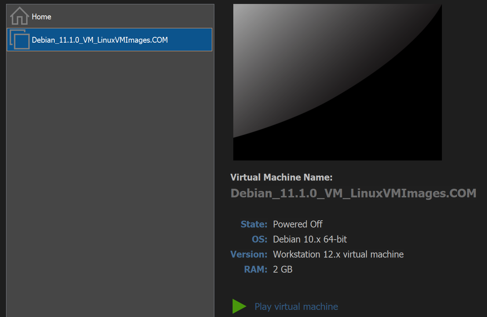

## Lena Aschauer
 *What type of programming experience?* 
Basic skills in Java, C, Python 
*What have you done with micro controllers, which ones have you used? (Like Arduino, ESP8266, Particle/Photon) *
I haven’t used any micro controllers. 
* Which single board computers do you know/have you used (Raspberry Pi, Orange Pi, Beaglebone, Labrador)? *
I haven’t used any board computers. 
* Who is a maker or part of a maker community? What do you like, would you like about it? How could it relate to this class? *
I had crafts in junior high school, which I enjoyed. It's nice to be able to work with your own hands. IoT represents the interface between hard and software, so I assume that we need it to connect hardware components.
* What do you already know about IoT?  *
I have to say, I didn’t really know anything about it. I know that objects like Alexa and smart cars belong to it but not more. 
* What are your expectations from this class? *
That we learn here how we can optimally connect and optimize the hardware components in our project with the software.

## Lecture 1 – 07.11.2022

**What does the Internet of Things entail?**
A simple Internet of Things definition is that it is a huge worldwide network of connected objects. These 'things' are embedded with sensors, processors and software to collect and share data about the way they are used and about the environment around them. An Internet of Things platform integrates data from the different devices and applies analytics to share the most valuable information with applications built to address specific needs.
https://www.nanowerk.com/smart/internet-of-things-explained.php

**Domains:** 
Industrial - IIoT monitors the quality of any product at each stage, from procurement to the final delivery. Moreover, it corrects and prevents risks in the product lifecycle.

Medical - tracking how many patients are in a hospital, receiving the correct medicine for a patient, and monitoring their health at a distance, also known as Telemedicine

Building and House Automation - users can manage wireless instruments from anywhere. 

**Protocols:** 
The benefit and value of IoT comes from enabling the components to communicate.
This communication happens via IoT protocols, which ensure that data sent from endpoint devices, such as sensors, is received and understood by the next and subsequent steps in the connected environment, whether the next step for that data is to another endpoint device or a gateway or an application.

1. AMQP Short for Advanced Message Queuing Protocol, AMQP is an open standard protocol used for more message-oriented middleware. 

2. Bluetooth is a short-range wireless technology that uses short-wavelength, ultrahigh-frequency radio waves. 

3. Cellular provides high bandwidth and reliable communication. It's capable of sending high quantities of data, which is an important capability for many IoT deployments. 

**Typical Devices:** 
Home Security  - The key driver behind smart and secure homes is IoT. A variety of sensors, lights, alarms and cameras (all of which can be controlled from a smartphone) are connected via IoT to provide 24x7 security. 

Activity Trackers - Smart home security cameras provide alerts and peace of mind. Activity trackers are sensor devices that can monitor and transmit key health indicators in real-time. You can track and manage your blood pressure, appetite, physical movement and oxygen levels.

**#LikeABosch** 
Wearables – Smartphone connected with fridge
Smart Cities – autonomous cars 

Benefits of IoT:
Better use of resources and assets
Cost-effective operation
Improved work safety
Efficiency and productivity
Improved experience

Challenges IoT:
Security flaws
Power supply dependence
Network dependence
Associated costs

**ESP8266** 
Why esp8266?
Has changed his live. You can easily program this network and attach LEDs sensors etc. to it. Everything is affordable.  It’s the bridge from software to hardware. 

 What is personally inspiring for you?
It makes it possible for everyone to create new things, no matter how much money you have.

 What is the connection to coffee?
Espresso Light was the first version – changed how we design and build things because it’s so cheap. It’s the same price as the price of a coffee.  

**Reflection:** 
Today I got my first insight into working with IoT. I had nothing to do with it before. It was exciting to see the different components of a network and to learn about them. I didn't know there were so many different sensors and I'm impressed with what's possible. My teammates Josh, Kyle and Luthando were very helpful because they could explain some things to me and Amadeo in more detail since they have already worked with it. We worked together on the list and created a good overview of everything through it. The video about the Espresso Light and esp8266 was also very interesting. The video brought everything important to the point and you can take a lot from it.

## Lecture 2 – 08.11.2022

The task descriptions can be found in our <a href= https://github.com/AmadeoNoelsPXL/aquaponics/blob/IoT-Documentation-Branch/Documentation/L&A/L&A_Documentation.md#8112022> Pair-Report </a>. 

**Reflection** 
Our first day was not exactly optimal. We got acquainted with the hardware and the programs, which took quite a long time and still not everything was clear to us. But we got through it and when we put our hands on everything it got a lot better. The professor was also very supportive. It was especially difficult for us to understand the professor's assignment correctly. Therefore, it often happened that we did something wrong or did something completely different than we should have done. But the professor always brought us back on the right track and also supported us with our "extra tasks". But also our colleagues Josh and Malu supported us well and always came to our aid when we were stuck. at the end of the day we definitely knew our way around a lot better. [...]  We learned how to make a light on an ESP8266 shine, how to set up a web client and server, and how to (almost) break an ESP8266. Be careful with the 5 Volt.

## Lecture 3 – 09.11.2022

The task descriptions can be found in our <a href=https://github.com/AmadeoNoelsPXL/aquaponics/blob/IoT-Documentation-Branch/Documentation/L&A/L&A_Documentation.md#9112022>Pair-Report</a>. 

**Node-RED intro: **
What is Node-RED in your first impression? 
Node-Red was very clear for me. The operation is easy to understand, with the individual nodes, the area where you connect them together and the debug window.

What do you think you could use it for? 
For me Node-Red looks like you can plan your network there. Exactly how the individual components are connected to each other and how they are used. Also what settings you have to make and their interrelationships.

What are other intersting iotempower gateway services? 

**Reflection** 
Today our lesson was a lot better. We knew our way around and it was a lot of fun. It was great to work step by step towards the goal. For our first tasks we had to create MQTT connections between different nodes and try the general logic of the environment. Afterwards we moved on to connecting actual devices to these MQTT connections and displaying the data on our NODE Red UI. We tried diverse combinations on the breadboard, built the connections, created a user interface. We were very energetic and had a small moment of success after each step. We were also able to help a few of our classmates, such as Lyle, Nihal, and Christian, who were having trouble creating the connections. But we also received help from our professor. We don't understand the tasks 100% yet, but we understand the connections between nodes, the hardware as well as the software. In between we also had some problems with the Node-RED, because we unintentionally overwrote our flows. We also had someone else unintentionally logging into our network and deleting our flows. But in the end we mastered everything. 

## Lecture 4 – 11.11.2022

The task descriptions can be found in our <a href=https://github.com/AmadeoNoelsPXL/aquaponics/blob/IoT-Documentation-Branch/Documentation/L&A/L&A_Documentation.md#11112022>Pair-Report</a>. 

**Scaling and testing + nice to have" discussion, personal notes**
What will be issues scaling (system size, number of systems, management)?
- How to handle privacy and security?
- What about the documentation?
- What when several people deploy at the same moment?
- Is there enough bandwidth?

How can we do testing?
- Use stories and implement them
- simulate environments

What would you like to see for scaling up? (What is not so great currently?)
- Single accounts for each user -> more privacy and less problems mit deployment

What role will play
- Simulations can be used for testing
- MQTT can be used for integration and security
- Stories can be used for testing 

Nice To Have
- scalability
- connectivity
- security
- dynamic nature
- analyzing

**Reflection** 
I didn't think today's lesson was that great. We had some problems with setting the IoTEmpower, which cost us a lot of time. After that, we got to work. We managed to complete some tasks including the button to sound and notification. We had a lot of fun with the task: Send message through the internet to your phone/Internet push button. We solved it by creating a discord server to which messages are sent by clicking on a button. But unfortunately the day was also a bit boring. Since we had only one display available we had to work together with the other pairs and could not do very much. Hopefully this will be better next time. On the whole, it was interesting to see how the steps that we had done in the previous lessons Manuel can now be done easily with a few commands. 

## Lecture 5 – 11.11.2022

**Reflection** 
Today actually went exactly like the last lesson. In the morning we talked about our portfolios. Then we continued to work on our tasks and were able to finish the work with the touch sensor and moisture sensor. Luckily, there were no problems.  Our colleagues Jon and Josh gave us a few tips to get to our goal faster. This was especially helpful in assembling the breadboard. The professor was also able to solve the problem with setting the IoTEmpires over the weekend, which took him a lot of time.  Speaking of time, it passed very quickly and so it was time to say goodbye to our professor Ulrich at the end of the lesson. I have learned a lot about IoT in the last week and I am very happy about it, thank you!

## Lecture 6 - 15.11.2022

**Short presentation of <a href=https://github.com/AmadeoNoelsPXL/aquaponics/blob/IoT-Documentation-Branch/Documentation/L&A/L&A_Documentation.md#9112022>IoT-scenarious</a>(10 min each)**

**Short presentation of the current state of projects (15-20 min each)** 
Google docs: https://docs.google.com/presentation/d/1AB9427Mz43Jxqp1JAkuUrCHxulFLlcXiawb3ESTPtyg/edit#slide=id.gc6f9e470d_0_0

**Install Windows Subsystem for Linux (Debian)** 
I started of by downloading the VMWare Workstation 16 Player and downloading the latest Debian version. I added the Debian VW into the Workstation. 

  

**Install all necessary tools and libraries for SNode.C** 
I went to the terminal and installed the following packages: 
- build-essential needed to compile code.
- manpages-dev contains documentation about all std-library functions and classes.
- cmake automates build process of applications and libraries
- clang C Language Family Frontend for the Low Level Virtual Machine LLVM. 
- qtcreator a versatile Integrated Development Environment IDE. 

Install all Hard Dependencies: 
- libeasyloggingpp-dev for logging.
- libssl-dev for SSL and TLS encrypted data exchange.
- pkg-config package for cmake used to search for already installed libraries.
- nlohmann-json3-dev for JavaScript Optiont Notation (JSON) support. 

Install all Soft Dependencies: 
- clang-format to format the source code consistently.
- cmake-format to format all CMakeLists.txt files consistently.
- doxygen to create the documentation.
- iwyu to prove that all required include files are explicitly included.
- libbluetooth-dev for bluetooth transport.
- libmagic-dev for mime-type-detection of files.
- libmariadb-dev for database access. 

**Clone SNode.C from github** 
With the git clone command I cloned the git repository into my projects/snocde.c directory. 
git clone https://github.com/VolkerChristian/snode.c

**Compile and install SNode.C** 
I imported the SNode.C into the QT Creator and build and installed SNode.C.
  

**Clone MQTTBroker from github** 
With the git clone command I cloned the git repository into my projects/mqttbroker directory. 
git clone https://github.com/VolkerChristian/mqttbroker

**Compile and install MQTTBroker** 
I imported the MQTTBroker int to the QT Creator and build and install MQTTBroker.
  

**Learn commandline arguments of SNode.C applications using --help-all** 
Usage: snode.c [OPTIONS] [SUBCOMMAND]  
General Options: 
  -h,--help: Print this help message and exit  
  --help-all: Expand all help  
  -s,--show-config: Show current configuration and exit  
  -w{/home/debian/etc/snode.c/conf/snode.c.conf},--write-config{/home/debian/etc/snode.c/conf/snode.c.conf}: Write config file 
  -l,--log-file [/home/debian/etc/snode.c/log/snode.c.log]: Log to file  
  -d,-f{false},--daemonize,--foreground{false}: Start application as daemon 
  -k,--kill: Kill running daemon 
  -e,--enforce-log-file: Enforce writing of logs to file for foreground applications 
  -c,--config [/home/debian/etc/snode.c/conf/snode.c.conf]: Read an config file 

Application Options: 
  --web-root [path] REQUIRED: Root directory of the web site 

Subcommands: 
testapp 
  Configuration for instance 'testapp' 
  Options: 
    --backlog [backlog]: Listen backlog 
    --accepts-per-tick [count]: Accepts per tick 
  Subcommands: 
    local: Bind options  
    cluster: Options for clustering  
    connection: Options for established connections 

**Finding bugs in the source code and/or the slides** 
Run settings - system-wide use:  
  

**Reflection** 
Today was exciting and frustrating at the same time. We got a short introduction to SNode.C and then started setting up the virtual machines. Yes, and that was a challenge. We spent almost 6 hours and mine is still not working. I started of by downloading the virtual Box and integrated to it an image our professor Harrer Martin provided to us. In the beginning everything walked ve In the beginning it went pretty well and I was able to help some colleagues like Christian and Amadeo. But after that my versions didn't fit anymore and that's when the problems started. In the end I had to restart the installation of a new Image. (explanation) In the end we were all happy that the class was over. Hopefully it will be better next time. 

## Lecture 7 - 17.11.2022

**Reflection** 
Today we went deep and learned a lot about how to use SNode.C to "link" an MQTT broker instance to a web server instance. To begin we had to install various development tools on the Raspberry Pi. Then we executed some commands together in the terminal and worked step by step on build.  Also the single parts of the code to build a webserver were explained to us in a very understandable way. The class was very informative, but it was also quite a lot of info at once. By the end of the day, we all had our heads spinning. 

## Lecture 8 - 21.11.2022

**Reflection** 
Today we have looked very closely at how to learn to use SNode.C to "link" a MQTT broker instance to a web server instance. Professor Volker has implemented the code step by step with us. We had some problems building the CMake project in the beginning. But with the help of our professor we managed it. After that came the next challenge, to integrate the code appropriately. It was a challenge for us to figure out which part of the code to put in which file. But in the end we were able to do it. 

## Lecture 9 - 23.11.2022

**Reflection** 
Today we started of by editing the raspi-boot.sh, so the mqttbroker doesn't start anymore while booting. Then we manage to start the mqttbroker via our terminal. We have installed libraries to replace the mosquitto MQTT broker on the Raspberry Pi with the Snode.C-based mqttbroker application. Similarly, we downloaded and ran the mqttbroker application. After that, we had to configure it individually and then test it with the mosquitto_sub/pub tasks. Fortunately everything worked as expected, this allowed us to stop the mosquitto MQTT broker and enable the mqttbroker application to start automatically when the Raspberry Pi boots up. After that we continued our documentation. 

## Lecture 10 - 24.11.2022

**Reflection** 
Today we created a root CA and an end certificate and used these certificates to secure the connections of an MQTT broker and the mosquitto_sub/pub task. For this, we generated and installed a private key and signed certificates on the root CA, the MQTT broker and the mosquitto_sub/pub task. Each entity had to be configured to trust the root CA's certificate in the process. This ensures that the MQTT broker and the mosquitto_sub/pub task can identify each other securely and communicate via a secure connection. Amadeo and I managed this task together. 

## Lecture 11 - 25.11.2022

**Reflection** 
Today we connected a Server and Client with the help of Certificates. We created the certificates and used the mosquitto. Our professor Volker showed us as well how to program and control devices by using the Alexa Skills Kit from Amazon. This was very fascinating and encouraged us to try it in the future at home. The day went well for us. At the end of the class there was a feedback round, which was partly positive but also negative. For me, the last few weeks have been very instructive. My learning curve was enormous at Hagenberg. In the beginning, I had no idea how to connect hardware with software, how the programming of connections via Wifi of devices works.  After one week, we were all already tinkering with different constellations and using snode.c for that. It was very interesting to learn more about the Raspberry Pi and the Wemos D1 Mini. After that we created our own virtual machine and used the qtcreator to create different connections like: creating an mqqtbrokerwebserver application. Which was also very informative and hopefulwill help us a lot in the future. 
